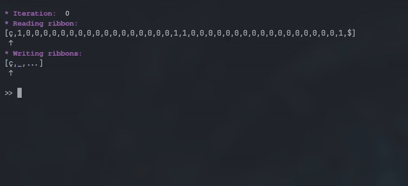

# $RITM$ : *R*ibbon *I*nteractive *T*uring *M*achine

[](https://github.com/PizzaManStarted/ritm/actions/workflows/rust.yml)

The goal of these crates is to allow users to experiment with **Turing Machines**. More particularly with non-deterministic machines with reading and writing tapes. 

## Table of Contents :

- [$RITM$ : *R*ibbon *I*nteractive *T*uring *M*achine](#ritm--ribbon-interactive-turing-machine)
  - [Table of Contents :](#table-of-contents-)
  - [Installation](#installation)
  - [Usage](#usage)
    - [Using the code directly](#using-the-code-directly)
    - [Using the GUI](#using-the-gui)
    - [Using the REPL (Read-Eval-Print Loop)](#using-the-repl-read-eval-print-loop)
  - [Parser](#parser)
    - [Main concepts](#main-concepts)
    - [Illegal actions](#illegal-actions)
    - [Turing Machine Example](#turing-machine-example)
  - [Acknowledgments](#acknowledgments)


## Installation

To build the entire project :
```bash
cargo build
```

## Usage

There are multiple ways to use this crate depending on your needs or preferences.

### Using the code directly

All the following tools are based upon the main crate called : `ritm_core`.

So it is also possible to use this crate for your own needs.

### Using the GUI

### Using the REPL (Read-Eval-Print Loop)

To run the REPL, execute the following command : 
```bash
cargo run -p ritm_repl
```



The REPL has multiple modes, each with a different purpose. For more information look at the relevant [README.md](ritm_repl/README.md) file.

## Parser

A parser was made to ease the usage of the crates. And the langage was made to be as easy and fast to use as possible.

### Main concepts 

In this section we will only go over the main details to take into accounts when writing a Turing machine. 

> [!NOTE]
> If you want to go further into how the grammar actually works, you can check out the following [`.lark` file](./ritm_core/src/turing_machine.pest).


| Name                 | Description                                                                                                  | Syntax                                                                                                                                            | Example                                           |
| -------------------- | ------------------------------------------------------------------------------------------------------------ | ------------------------------------------------------------------------------------------------------------------------------------------------- | ------------------------------------------------- |
| Initial character    | The starting character of any tapes.                                                                         | `ç`                                                                                                                                               | `ç`                                               |
| End character        | The last character of the reading tape.                                                                      | `$`                                                                                                                                               | `$`                                               |
| Blank character      | The character representing an empty value in a writing tape.                                                 | `_`                                                                                                                                               | `_`                                               |
| State name           | The name of a state inside a Turing graph.                                                                   | (`q_` or `q`) + name                                                                                                                              | `q_test` or `test`                                |
| Direction            | The movement to take after reading a character in a tape.                                                    | `L` : *left*, `R` : *right*, `N`: *none*.                                                                                                         | `L`                                               |
| Simple transition    | A transition between two states.                                                                             | state *from* `{` reading tape char, chars to read, ... `->` dir for reading tape pointer,  dirs to take, chars to replace them,... `}` state *to* | `q_1 {ç, _ -> R, _, N } q_2`                      |
| Multiple transitions | A list of transitions going between two states.                                                              | state *from* `{` transition content $1$ `\|` transition content $2$ `\|` ... `\|` transition content $n$  `}` state *to*                          | `q_1 { 0, _ -> N, _, L  \| 1, _ -> N, _, L } q_2` |
| Turing machine       | A Turing Machine, or in other words a Turing Graph, is simply a list of multiple transitions between states. | A list of (transitions + `;`)                                                                                                                     | See this [example](#turing-machine-example)       |
| Comment              | A line that will be ignored during the parsing.                                                              | `//` + line of text                                                                                                                               | // hi !                                           |


### Illegal actions

> [!WARNING]
> In order to protect the execution of a Turing machine, some preventions were implemented to forbid some actions considered *dangerous*. Don't worry you will not run into any of these if you are writing a normal Turing machine.

The following action will result in **errors** being returned.

| Concerned  | Action                                                         | Reason                                                                                      | Fix                                                |
| ---------- | -------------------------------------------------------------- | ------------------------------------------------------------------------------------------- | -------------------------------------------------- |
| Transition | Doing a read-move like : `$` + `R`.                            | Risk of going out of bounds of the tape.                                                    | Use `L` or `N` instead.                            |
| Transition | Doing a read-move like : `ç` + `L`.                            | Risk of going out of bounds of the tape.                                                    | Use `R` or `N` instead.                            |
| Transition | Replacing `ç` by another char.                                 | Turing tapes are supposed to start by `ç` and then there is a risk of going out of bounds.  | Replace it with itself.                            |
| Transition | Replacing `$` by another char.                                 | The reading tape is supposed to end by `$` and then there is a risk of going out of bounds. | Replace it with itself.                            |
| Transition | Replacing another char by `$` or `ç`.                          | Again, only the program should deal with special symbols.                                   | Replace it with a normal character.                |
| Word       | The word contains `_`, `ç` or even `$`.                        | These character can only be used by the program.                                            | Only use them in transitions.                      |
| States     | Adding transitions that don't affect the same number of tapes. | All transitions should affect the same number of tapes inside a graph.                      | Remove the problematic transitions or modify them. |


### Turing Machine Example

This *non-deterministic* machine accepts the following language :
$L =$ { $xx | x \in \Sigma^*_{bool}$ }
```
q_i { ç, ç -> R, ç, R } q_1;

q_1 { 0, _ -> R, 0, R 
    | 1, _ -> R, 1, R } q_1;

q_1 { 0, _ -> N, _, L 
    | 1, _ -> N, _, L } q_2;

q_2 { 0, 0 -> N, 0, L 
    | 0, 1 -> N, 1, L 
    | 1, 0 -> N, 0, L 
    | 1, 1 -> N, 1, L } q_2;

q_2 { 0, ç -> N, ç, R 
    | 1, ç -> N, ç, R } q_3;

q_3 { $, _ -> N, _, N } q_a;

q_3 { 0, 0 -> R, 0, R 
    | 1, 1 -> R, 1, R } q_3;
```

This graph was used for the execution shown in the following [section](#using-the-repl-read-eval-print-loop) with the input : $\texttt{10000000000000000011000000000000000001}$.


## Acknowledgments

This project was realised by two umons students :
* [Adrien Zianne](https://github.com/AdrienZianne)
* [Axel Foucart](https://github.com/PizzaManStarted)